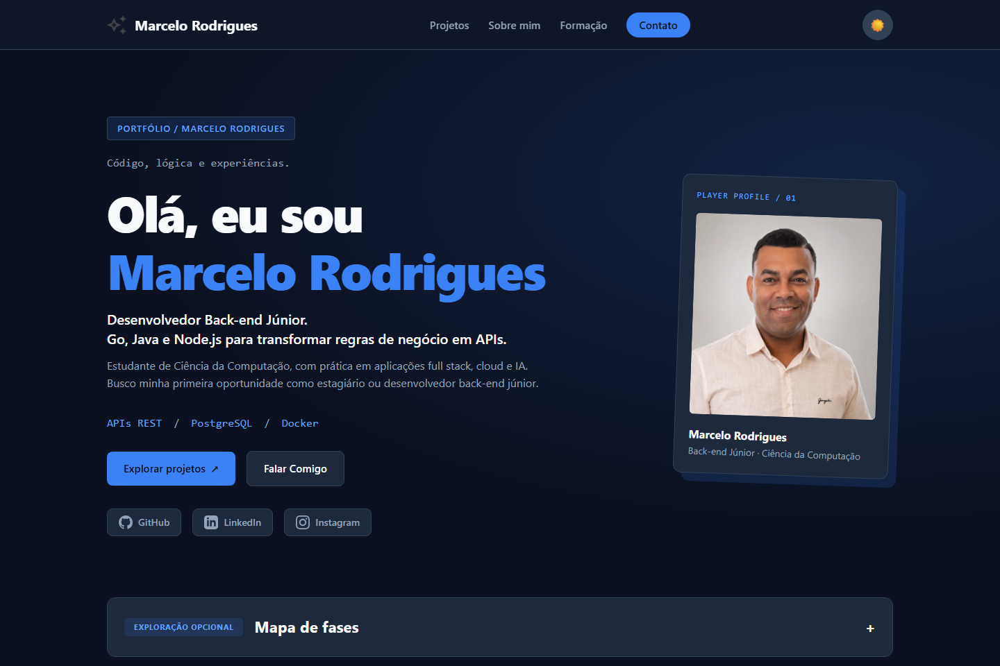
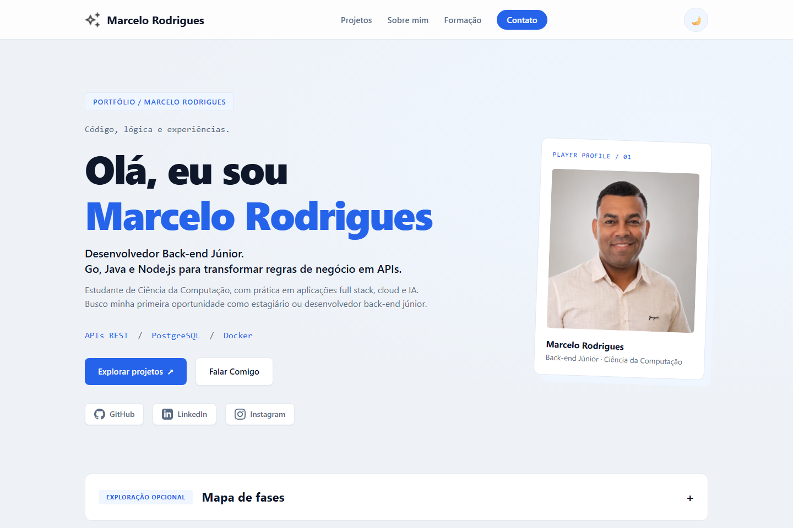

# Portfólio — Marcelo Rodrigues

Código, lógica e experiências. Meu portfólio reúne projetos, trajetória e certificações em uma interface inspirada em jogos, com acesso direto às informações profissionais.

Gosto de conhecer e entender o porquê do que faço e como cada coisa funciona. Este portfólio acompanha meu caminho: aprender, experimentar e explicar as escolhas por trás das soluções.

**[▶ Explorar o portfólio](https://challenge-one-portfolio-nine.vercel.app/)**

[](https://challenge-one-portfolio-nine.vercel.app/)

## Escolha sua fase

Explore em qualquer ordem. Os links levam às seções do site; não há conteúdo bloqueado por progresso.

- **[01 / Projetos](https://challenge-one-portfolio-nine.vercel.app/#xp)** — código, demos e decisões técnicas de seis projetos selecionados, além de trabalhos anteriores.
- **[02 / Sobre mim](https://challenge-one-portfolio-nine.vercel.app/#sobremim)** — trajetória, tecnologias e interesses pessoais.
- **[03 / Formação](https://challenge-one-portfolio-nine.vercel.app/#formacao)** — cursos e certificações com suas fontes, incluindo Oracle Cloud Infrastructure (OCI) Foundations Associate.
- **[04 / Contato](https://challenge-one-portfolio-nine.vercel.app/#contato)** — e-mail, LinkedIn e formulário.

## Por dentro da experiência

<details>
<summary>🎮 Navegação por fases e identidade pessoal</summary>

O mapa de fases é opcional: a navegação direta permanece disponível. O progresso representa apenas as seções visitadas durante a sessão, sem pontuação profissional ou desbloqueios.

Os cards de interesses revelam um pouco da minha história ao serem expandidos. Temas claro e escuro mantêm a identidade azul. A primeira visita começa no tema escuro; uma escolha anterior do visitante é preservada quando o armazenamento está disponível.

</details>

<details>
<summary>⚡ Projetos úteis mesmo quando a API falha</summary>

Os cards trazem conteúdo local, links de código, demos quando disponíveis e decisões técnicas documentadas.

A consulta de atividade no GitHub é opcional e ocorre sob demanda. Ela mostra último push, linguagem principal e arquivamento, sem tokens no frontend. Falhas de rede, timeout ou limites da API não removem os projetos.

</details>

<details>
<summary>⌨️ Acessibilidade e uso em diferentes telas</summary>

- Layout adaptado a celular e desktop.
- Navegação por teclado, foco visível, link para pular conteúdo e fechamento do menu com Escape.
- Respeito à preferência por movimento reduzido.
- Conteúdo disponível sem JavaScript; contato por e-mail e LinkedIn nessa condição.

Esses recursos não representam uma auditoria completa de conformidade WCAG.

</details>

<details>
<summary>✉️ Canais de contato e formulário</summary>

E-mail e LinkedIn oferecem acesso direto. O formulário usa JavaScript, validação de campos, contador de caracteres e integração com FormSubmit, com mensagens de carregamento, sucesso e erro.

Sem JavaScript, a seção orienta o uso dos links diretos. O envio depende da disponibilidade do serviço externo.

</details>

<details>
<summary>🧭 Por que construí o portfólio dessa forma?</summary>

- **HTML, CSS e JavaScript nativos:** mantêm esta interface estática sem instalação de pacotes ou etapa de build.
- **Game opcional:** a identidade visual convida à exploração, enquanto os links diretos facilitam encontrar as informações profissionais.
- **Conteúdo local e API sob demanda:** as informações essenciais não dependem de uma consulta remota funcionar.
- **Fontes individuais para credenciais:** permitem consultar a procedência e distinguir informações verificadas de pendências.
- **Tema escuro inicial, escolha preservada:** expressa minha preferência visual e mantém o tema claro disponível para quem preferir.

</details>

<details>
<summary>🌓 Comparar as prévias dos temas</summary>

### Tema escuro — padrão na primeira visita


### Tema claro — opção do visitante



Capturas da versão local. O seletor de tema funciona no site; estas imagens são prévias estáticas.

</details>

## Stack deste portfólio

**HTML · CSS · JavaScript** — sem instalação de pacotes ou etapa de build.

HTML semântico, CSS Grid, Flexbox e variáveis CSS compõem a interface. JavaScript cuida das interações, preferências e consultas via Fetch API.

## Execute localmente

Para uma nova cópia:

```bash
git clone https://github.com/MarceloRodrigues1853/challenge-ONE-portfolio.git
cd challenge-ONE-portfolio
```

No VS Code, abra `index.html` com **Open with Live Server**. Também é possível abrir o arquivo diretamente no navegador para explorar o conteúdo estático.

<details>
<summary>📂 Explorar a estrutura do projeto</summary>

- `index.html`: conteúdo e estrutura semântica.
- `style.css`: layout, temas e responsividade.
- `validate.js`: tema, navegação e validação do formulário.
- `github-projects.js`: consulta opcional de metadados dos projetos.
- `assets/`: imagens, logos, selos e prévia do portfólio.

</details>

## Autor e documentação

**Marcelo Rodrigues** — [GitHub](https://github.com/MarceloRodrigues1853) · [LinkedIn](https://www.linkedin.com/in/marcelorodriguesdev1853/) · [Credly](https://www.credly.com/users/marcelo-rodrigues.26e8de27/badges/credly)

O projeto começou no desafio de portfólio do programa Oracle Next Education (ONE), em parceria com a Alura, e evoluiu para esta experiência pessoal.

[Documentação técnica e manutenção](DOCS.md) · [Fontes e limites de verificação do conteúdo](CONTENT_SOURCES.md)
